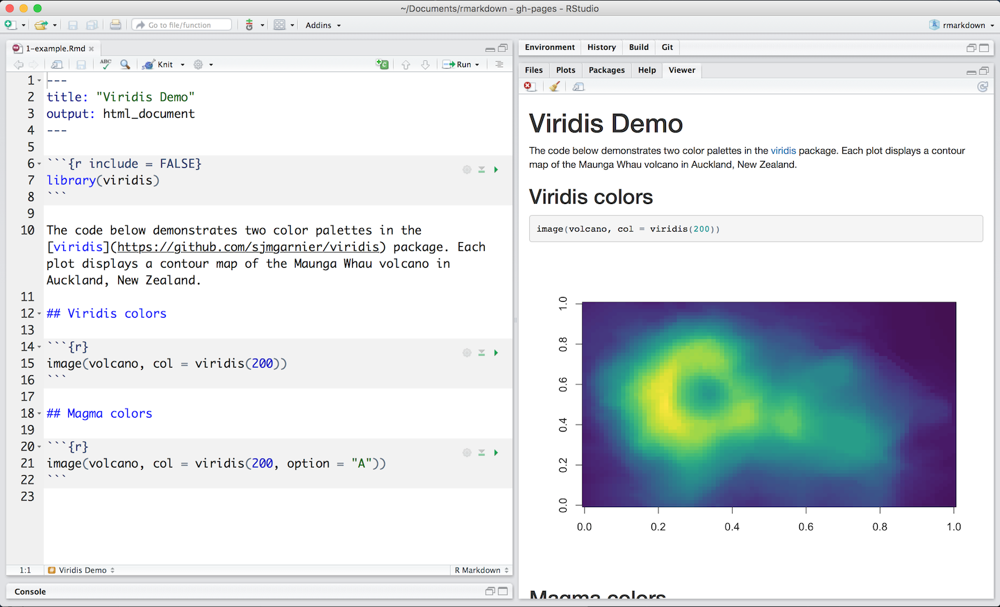

### Apache Spark Machine Learning Blueprint

Chapter.5 Risk Scoring on Spark

chie hayashida

---

### Agenda

* Introduction
* Spark for risk scoring
* The use case
* Apache Spark notebooks
* Methods of risk scoring
	* Logistic regression
	* Random forest and decision trees
	* Data and feature preparation
	* OpenRefine
* Model estimation
* Model evaluation
	* Confusion matrix
	* ROC
	* Kolmogorov-Smirnov
	* Results explanation
	* Big influencers and their impacts
* Deployment
	* Scoring
* Summary

@title[Agenda]
---
### Spark for risk scoring

---
### Use Case
```
XST Corpはビジネス継続や個人的な緊急の事情のために現金を必要とする
数百万の個人へローンやその他の財政的支援を提供している。
この会社は、オンライン申し込みを受け付け、申し込みに対して
一時的な決断をする。
このために、彼らはオンライン申し込みの内容、DWHに収集済みの
過去のデータ、サードパーティから提供されるデータを利用する。

オンライン申し込みは個人を特定するデータと申込者の財政状況に関する
データを含む。
収集済みのデータは、地理、財政、その他に関連する情報を含む。
サードパーティによるデータは、過去のクレジット、現在の雇用状況等の
情報を含む。
```

---
### Use Case(続き)
```
この会社は競合会社が多く、変化が多い。
そこで、彼らは常に競合に負けないよりよいリスクスコアリングモデルを
探している。
具体的には、競合より精度良く不払いを予測し、不払いのリスクは低く、
かつたくさんの申込者の承認を行うことができ、簡単に導入できるモデルを
欲している。

3つのデータセットにより、この会社は2000もの特徴量を使って機械学習を行いたい。
よって、特徴量選択は非常に大きなタスクであり、同時に欠損等
データクオリティがそれほどよくないため、前処理も同様に大きなタスクである。
```
---
### Use Case(続き2)

```
この会社は、より多くの申込者に対して低いリスクで受け入れを行うという目標を
達成するとともに業界標準に準拠するモデル評価方法のアイデアを明確にもっている。
また、モデルのデプロイ方法も決まっている。

しかしながら、これらのタスクは少ない時間内に完了しなければならず、
かつできれば意思決定やモデル再構築の自動化したい。
このため、ノートブックを使ったアプローチが理想的である。
同時に、新しいデータは頻繁にやってくるため、新しいデータを取り入れて
再構築される必要がある。

このプロジェクトに対して、私たちは貸出債務不履行のターゲット変数、
オンライン申請者からの申請者データ、クレジットデータ、消費者データ、
公的記録データ、および前述の3つのデータソースのソーシャルメディアデータが
あります
```
---
### Apache Spark notebooks

```
前のセクションで述べたように、このプロジェクトでは、
複製と自動化のために機械学習を構成する必要がある。
このために、ノートブックを使用してすべてのコードを整理し、Apache Sparkで実装する。
ノートブックは複製を容易にし、将来の自動化のための良い基礎を提供する。

ほとんどのRユーザーはRパッケージのMarkdownに精通している。
Rのノートブックを簡単に作成できるため、Rからの動的な文書、分析、
プレゼンテーション、レポートを簡単に作成できます。
```
Rユーザ向け・・・？

---
### R markdownのサンプル
http://rmarkdown.rstudio.com/index.html


---
### Apache Spark notebooks(続き)
```
Apache sparkで利用できるnotebookの一つとして、
OSSであるApache Zeppelinがあげられる。
```

このへんを参考にしろとのこと。
* https://medium.com/sparkiq-labs
* https://jp.hortonworks.com/blog/introduction-to-data-science-with-apache-spark/

---?image=img/zeppelin_sample.png&size=auto 70%

---
### Apache Spark notebooks(続き2)
```
しかしながら、Zeppelinは多くのコーディングとシステム設定及び
Rを使うためにはRインタプリタも必要となる。
```
そんなに大変でもないけど。。。

```
Jupyter notebookでRを利用することもできる。
```
このへんを参考にしろと。
* http://blog.revolutionanalytics.com/2015/09/using-r-with-jupyter-notebooks.html

* Jypter notebookのExample
http://nbviewer.jupyter.org/github/carljv/Will_it_Python/blob/master/MLFH/CH2/ch2.ipynb

---
### Apache Spark notebooks(続き2)

```
JupyterもZeppelin同様多くのコーディングとシステム設定を必要とする。
これらを防ぎたいようであればDatabricksの環境をつかうとよい。
```

---
### math test

$$\sum_{i=0}^n i^2 = \frac{(n^2+n)(2n+1)}{6}$$

$$\hat{r}_{ij} = {p_{i}}^{T}q_{j} = \sum_{k=1}^{k}p_{ik}q_{kj}$$

@title[math example]
---
### fin3

@title[custome label]

