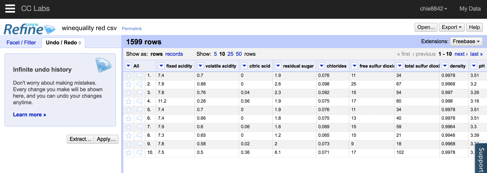

### Apache Spark Machine Learning Blueprint

Chapter.5 Risk Scoring on Spark

chie hayashida

---

### Agenda

* Introduction
* Spark for risk scoring
* The use case
* Apache Spark notebooks
* Methods of risk scoring
	* Logistic regression
	* Random forest and decision trees
	* Data and feature preparation
	* OpenRefine
* Model estimation
* Model evaluation
	* Confusion matrix
	* ROC
	* Kolmogorov-Smirnov
	* Results explanation
	* Big influencers and their impacts
* Deployment
	* Scoring
* Summary

@title[Agenda]
---
### Spark for risk scoring

---
### Use Case
```
XST Corpはビジネス継続や個人的な緊急の事情のために現金を必要とする
数百万の個人へローンやその他の財政的支援を提供している。
この会社は、オンライン申し込みを受け付け、申し込みに対して
一時的な決断をする。
このために、彼らはオンライン申し込みの内容、DWHに収集済みの
過去のデータ、サードパーティから提供されるデータを利用する。

オンライン申し込みは個人を特定するデータと申込者の財政状況に関する
データを含む。
収集済みのデータは、地理、財政、その他に関連する情報を含む。
サードパーティによるデータは、過去のクレジット、現在の雇用状況等の
情報を含む。
```

---
### Use Case(続き)
```
この会社は競合会社が多く、変化が多い。
そこで、彼らは常に競合に負けないよりよいリスクスコアリングモデルを
探している。
具体的には、競合より精度良く不払いを予測し、不払いのリスクは低く、
かつたくさんの申込者の承認を行うことができ、簡単に導入できるモデルを
欲している。

3つのデータセットにより、この会社は2000もの特徴量を使って機械学習を行いたい。
よって、特徴量選択は非常に大きなタスクであり、同時に欠損等
データクオリティがそれほどよくないため、前処理も同様に大きなタスクである。
```
---
### Use Case(続き2)

```
この会社は、より多くの申込者に対して低いリスクで受け入れを行うという目標を
達成するとともに業界標準に準拠するモデル評価方法のアイデアを明確にもっている。
また、モデルのデプロイ方法も決まっている。

しかしながら、これらのタスクは少ない時間内に完了しなければならず、
かつできれば意思決定やモデル再構築の自動化したい。
このため、ノートブックを使ったアプローチが理想的である。
同時に、新しいデータは頻繁にやってくるため、新しいデータを取り入れて
再構築される必要がある。

このプロジェクトに対して、私たちは貸出債務不履行のターゲット変数、
オンライン申請者からの申請者データ、クレジットデータ、消費者データ、
公的記録データ、および前述の3つのデータソースのソーシャルメディアデータが
あります
```
---
### Apache Spark notebooks

```
前のセクションで述べたように、このプロジェクトでは、
複製と自動化のために機械学習を構成する必要がある。
このために、ノートブックを使用してすべてのコードを整理し、Apache Sparkで実装する。
ノートブックは複製を容易にし、将来の自動化のための良い基礎を提供する。

ほとんどのRユーザーはRパッケージのMarkdownに精通している。
Rのノートブックを簡単に作成できるため、Rからの動的な文書、分析、
プレゼンテーション、レポートを簡単に作成できます。
```
Rユーザ向け・・・？

---
### R markdownのサンプル
http://rmarkdown.rstudio.com/index.html


---
### Apache Spark notebooks(続き)
```
Apache sparkで利用できるnotebookの一つとして、
OSSであるApache Zeppelinがあげられる。
```

このへんを参考にしろとのこと。
* https://medium.com/sparkiq-labs
* https://jp.hortonworks.com/blog/introduction-to-data-science-with-apache-spark/

---?image=img/zeppelin_sample.png&size=auto 70%

---
### Apache Spark notebooks(続き2)
```
しかしながら、Zeppelinは多くのコーディングとシステム設定及び
Rを使うためにはRインタプリタも必要となる。
```
そんなに大変でもないけど。。。

```
Jupyter notebookでRを利用することもできる。
```
このへんを参考にしろと。

* Jupyter Notebookの使い方
  * http://blog.revolutionanalytics.com/2015/09/using-r-with-jupyter-notebooks.html

* Jypter NotebookのExample
  * http://nbviewer.jupyter.org/github/carljv/Will_it_Python/blob/master/MLFH/CH2/ch2.ipynb

---
### Apache Spark notebooks(続き2)

```
JupyterもZeppelin同様多くのコーディングとシステム設定を必要とする。
これらを防ぎたいようであればDatabricksの環境をつかうとよい。

Databricksに加えて、IBMのDataScientist Workbenchではいろんな便利な
オプションがある。
DataScientistWorkbenchはApache Sparkがインストール済みで、
data-cleaningシステムやOpenRefineの実装があり、前処理が簡単にできる。
```
---
### Methods of risk scoring

```
環境準備が整ったはずなので、リスクモデルを機械学習手法にあてはめ、
実際に分析手法や予測モデルを選択する。

モデリングを行い、債務不履行を予測するため、ロジスティック回帰、決定木は
最もよく利用される手法である。
練習のために、両方とも試してみるが、ロジスティック回帰に焦点を当てる。
なぜなら、決定木と組み合わせて開発することにより、他のほとんどの手法と
比べて性能がよいからである。

いつもどおり、分析手法やモデルを決定したら、コーディングの準備に入る。
このChapterではRでかく。
```

う、R...

---
#### Logistic regression

```
ロジスティック回帰は、累積ロジスティック分布であるロジスティック関数を
使用して確率を推定することによって、1つのカテゴリ依存変数と1つ以上の
独立変数との間の関係を測定する。
ロジスティック回帰は、一般化された線形モデル(GLM)の特殊なケースと
みなすことができるので、線形回帰に類似している
```

---
#### Logistic Regression(続き)

```
私たちは、この実際のユースケースのロジスティック回帰について、
以前に言及したパフォーマンスの他に2つの理由から主に選択しました。
* ロジスティック回帰はシンプルな計算とともに簡単に解釈される。
* ほとんどの金融企業が過去にロジスティック回帰を実施してきた。
  クライアントにとって、私達の結果とほか企業から過去に受け取った結果を
  比較しやすい。
```

---
#### Preparing coding in R

```
Rでは、ロジスティック回帰のいろんな書き方がある。
前章では、私達はRのglmを使ってこう書いた。

  Model1 <-glm(good_bad ~.,data=train,family=binomial())

一貫性を保つため、ここでglm関数を引き続き使用する。
```

補足1 Sparkでは、Scala, Java, Python,Rの4原語全てにおいて、
2クラス及び他クラスロジスティック回帰の実装がある。

補足2 リスクスコアリングのデータセット
* [Randall - Global Risk Score Dataset.xlsx](https://www.researchgate.net/publication/307638436_Randall_-_Global_Risk_Score_Dataset)
* [Analysis of German Credit Data](https://onlinecourses.science.psu.edu/stat857/node/215)
---
### Random forest and decision trees

```
ランダムフォレストは、分類とか行きにおけるアンサンブル学習の手法であり、
学習時に数百かそれ以上の決定木をつくってその出力をあわせて
最終的な予測を行う。

ランダムフォレストは、その解釈が非常に直感的であり、
通常ロジスティック回帰より少ない労力で良好な結果につながるため、
非常に人気のある機械学習手法である。

ランダムフォレストの実装はRやJavaや他の言語による多くあり、準備は比較的
簡単である。
```

---

### Random forest and decision trees

```
このプロジェクトの焦点はロジスティック回帰であるため、
ランダムフォレストが、機能選択のためのロジスティック回帰を支援し、
特徴量の重要性を計算するのに役立つ。

前述したように、ロジスティック回帰と組み合わせた決定木は、
しばしば良好な結果をもたらす。
ここで決定木のモデリングを行い、クライアントにはルールベースの
ソリューションをテストし、スコアベースのソリューションと
比較するために決定木を使用する
```
---

#### Preparing coding

```
Rでは、Leo BreimanとAdele Cutlerが独自開発したRパッケージ
randomForestを使用する必要がある。

randomforestモデルの推定器を得るために、
私達は学習データと2000のツリーを利用して、
以下のようなR codeを利用する。
```
```
library(randomForest)
Model2 <- randomForest(default ~ ., data=train, importance=TRUE, ntree=2000))
```
---

#### Preparing coding

```
モデル学習が終わったら、getTreeやimportanceで結果を取得できる。
決定木のRによる実装方法はいくつかある。
```
```
Model3 <- rpart(default ~ ., data=train)
```

---
### Data and feature preparation

```
Chapter 2. Data Preparation for Spark MLのFeature extraction では、
私たちは特徴量抽出の方法をいくつか復習し、Apache Sparkにおける
実装について論じた。
全ての技術について、このrisk scoringプロジェクトで使うことができる。
```
---
### Data and feature preparation

```
先に言及したとおり、このプロジェクトにおける主な関心事は、
ワークフローの再現性、及び場合によっては自動化を行うことである。
データと機能の準備のためにOpenRefineを採用する。
それが統合されたDataScientistWorkbench環境内でこのOpenRefineを使用する。
```

---
#### OpenRefine

```
OpenRefineは正式にはGoogle Refineといい、オープンソースの
データクリーニングのアプリケーションである。
OpenRefineを使用するにあたっては、以下のサイトに行く。
https://datascientistworkbench.com
```
---


---
#### OpenRefine

```
OpenRefineにデータセットをインポートして、プロジェクトを作成し、
データクレンジングと前処理を行う。
その後、前処理後のデータをエクスポートして、notebookに
ドラッグアンドドロップでアップロードする。

このプロジェクトでは、ID照合（照合）、重複の削除、
およびデータセットのマージにOpenRefineを使用した。
```
---
### Model estimation

```
このセクションでは、モデル評価を完了するために
DataScientistWorkbench内のRノートブックを利用する方法と
手順について説明する。
```
---
#### The DataScientistWorkbench for R notebooks

```
OpenRefineを使用してデータを準備したら、
"Methods for risk scoring"の節で準備したコードと
「Data and feature preparation」の節で準備したコードを
データに適用するRノートブックを開発する。

次のスクリーンショットに示すように、
DataScientistWorkbenchを使用すると、インタラクティブな
Rノートブックを作成して実行し、共有することができる。

Rユーザに人気のあるR Studioも、DataScientistWorkbenchで
利用できる。
```
---

---

#### The DataScientistWorkbench for R notebooks

```
ノートブックを起動するには、「Build Analytics」をクリックしてから
「Notebook」をクリックするか、次のスクリーンショットにある
「ノートブック」の青いボタンを直接クリックする。

Rノートブックが開発されると、「Recent Notebooks」の下に表示され、
他の環境と同様に結果を得るために実行することができる。
```

---
### R notebooks implementation

```
モデル推定の主なタスクは、Data Scientist Workbench環境内で
Rノートブックの実装をスケジュールすることである。
これを行うには、前のセクションで開始したRノートブックを
使用する必要があります。
そのためには、以下のすべてのRコードを挿入する必要がある。
```
* Logistic Regression

```
Model1 <-glm(good_bad ~.,data=train, family=binomial())
```
* Random Forest

```
library(randomForest)
randomForest(default ~ ., data=train, na.action=na.fail,
importance=TRUE, ntree=2000)
```
* Decision Tree

```
f.est1 <- rpart(default ~ r1 + ... + r21, data=train, method="class")
```
---
### Model evaluation

```
前のセクションで説明したようにモデル推定を完了した後、
これらの推定モデルを評価してクライアントの基準に適合するかどうかを確認し、
結果の説明に移動するか、前の段階に戻って予測モデルを改善する必要がある。

モデル評価を行うために、このセクションでは、混同行列を使用して
モデルの適合度を評価し、他の統計に展開します。

いつものように、それらを計算するには、学習データではなく評価データを
使用する必要がある。
```
---
#### Confusion matrix

```
Rでは、次のコードでモデルのパフォーマンス指標を生成できます

model$confusion

切断点が決定されたあと、次の混同行列が生成される。
良い結果が見られる。
```

|Model's Performance | Predicted as Default | Predicted as NOT(Good) |
|--------------------|----------------------|------------------------|
|Actual Default      | 89%                  | 11%                    |
|Actual Not(Good)    | 12%                  | 88%                    |

---
#### Confusion matrix

```
このプロジェクトでは、リスクの高い応募者を可能な限り不承認とする
左上のセルの比率を上げたいので、前の表が最も重要な評価である。
しかし、彼らはまた、偽陽性率を可能な限り減らすこと、すなわち、
良好な顧客を拒絶しないことである、左下のセルにおける比率を
減少させる必要がある。

しかし、前述の結果はカッティングポイントを選択する方法に依存するため、
スコアを比較するのに最適なテーブルではない。
このため、単一のポイントに依存する統計ではなく、
要約統計として、ROCとKSを使用する必要があります。
```
---
#### 補足スライドかく
---
#### ROC

```
ROC(Receiver Operating characteristic Curve)は、
真陽性誤り率(TP)と偽陽性誤り率(FP)との間のトレードオフの範囲にわたる
分類器性能を要約するための標準的な技術である。 
ROC曲線は、可能なカットオフ分類確率値に対する1特異性に対する
感度（事象を正確に予測するモデルの能力）のプロットである。
```
---
#### ROC

```
可能な全てのカットオフ点の予測力を要約しているので、
ROC曲線は混同行列よりも有益である。
以下のグラフに示すように、ROC曲線の下の面積は1であり、
ROC曲線の下の面積は無価値のモデルを意味する。
```

---
#### Rのコード
```
# load library
library(ROCR)
#score test data set
test$score<-predict(m,type='response',test)
pred<-prediction(test$score,test$good_bad)
perf <- performance(pred, "tpr","fpr")
plot(perf)
```
---
### Kolmogorov-Smirnov

```
コロモゴロフ-スミノフ（KS）値は、モデルを評価するために
業界で頻繁に使用されている累積偽陽性率と累積偽陽性率の最大差である。

このコードは、ROCRによってプロットされている
累積の悪いレートと良いレートの間の最大の差をとっている。
```

```
max(attr(perf, 'y.values')[[1]]-attr(perf, 'x.values')[[1]]
```
---
### Kolmogorov-Smirnov

```
このセクションのRコードと前のセクションのRコードを組み合わせることで、
ロジスティック回帰モデルを推定し、ROC値と推定モデルのKS値を
得るための完全なプロセスとなる。

さまざまな金融サービスの製品やさまざまな顧客セグメント、
さまざまな機能の組み合わせについては、実行するモデルがたくさんあるが、
Apache SparkのDataScientistWorkbench向けのノートブックアプローチを
使用して迅速に完了することができる。

推定された全てのモデルについて、我々のクライアントはまず、
KS値が0.40より大きく、ROC値が0.67より大きいモデルを選択する。
その後、主題知識を使用して選択を確定する。
```

---
### Results explanation

```
これまでのように、モデル評価段階を経て最終モデルとして推定モデルを選択すると、
次のタスクは、会社の役員と技術者の結果を解釈することである。

次のセクションでは、大きな影響を与えるいくつかの変数についての
結果の説明を行う。
大きな影響力を持つ変数を特定して、適切な顧客を募集するための
マーケティング活動を改善するために使用することができる。
```
---
#### Big influencers and their impacts

```
ロジスティック回帰の結果では、回帰係数を使用して各特徴量の影響を説明し、
それらの係数を比較して大きな影響力を持つ説明変数がどれかを識別できる。

同じ論理では、ロジスティック回帰係数によって計算されるような効果によって
各特徴をランク付けすることもできる。

もう1つの方法は、John Foxなどが作成したR効果のパッケージを使用して、
特に線形モデルと一般化線形モデルの効果を表示する方法である。
このパッケージを使用することで、リストと、プロット（エフェクト）の
機能を備えたいくつかのグラフィック表示を得ることができる。
```
---
#### Big influencers and their impacts

```
これをより高いレベルにするために、ユーザは、特別に作成されたRパッケージ
relaimpoを使用して、以下のコードを使用する必要がある予測変数の
相対的重要性を評価することができる。
ここで、"lmg"は作者のLindeman, Merenda, Goldの名前からきている。
```

```
library(relaimpo)
calc.relimp(model1, type = c("lmg"), rela = TRUE)
```
---
#### Big influencers and their impacts

```
以前の章で使用されているように、Rのランダムフォレストパッケージでは、
"estimatedModel$importance"のシンプルなコードによって、
デフォルトリスクを決定する際の重要度順に変数のランクを返すことができる。

しかし、randomForest関数による変数の重要性を得るには、
すべてのデータが完成した完全モデルを推定する必要がある。
だから私たちの問題を本当に解決するわけではない。

このプロジェクトでは、ロジスティック回帰から得られた結果に依存する。

私たちのクライアントとしては、いくつかの非常に興味深い洞察がある。
その中には、現在の住所の滞在期間やソーシャルメディアの影響など、
影響を受けたものがいくつかある。
```
---
### Deployment

```
前の章で説明したように、推定モデルをスコアに変換するのは難しいことではなく、
Spark以外のプラットフォームでも実行できる。
しかし、Apache Sparkは、デモのとおり、簡単かつ迅速に行う。

この章で採用されているノートブックのアプローチでは、
データと顧客の要件が変更されたときに新しいスコアを
迅速に生成できるという利点がある。

ユーザは、前章（詐欺検出のためのスコアリングの展開）との幾つかの類似点を
見つけるだろう。
```
---
#### Scoring

```
予測モデルの係数から、可能なデフォルトのリスクスコアを導出することができる。
これにはいくつかの作業が必要である。
しかし、それはクライアントが必要に応じていつでも変更できる柔軟性を提供する。

ロジスティック回帰では、スコアを生成するプロセスは比較的簡単である。
ロジスティック回帰には次の式を使用する。
```
---
#### Scoring

$$\ln(\frac{P}{1-P})=a+bX$$
$$\frac{P}{1-P}=e^{a+bX}$$
$$P=\frac{e^{a+bX}}{1+e^{a+bX}}
$$
---
#### Scoring

```
Rでは、簡単な予測方法は以下である。
具体的には、この関数はデフォルトの確率値を生成する。
これはこのプロジェクトのスコアとして直接使用できる。
```
```
prob=predict(model,x,type="prob")
```
---
#### Scoring

```
ただし、スコアを使用するには、切り抜きスコアを選択する必要がある
たとえば、リスクスコアが90を超えた場合にのみ行動を取ることができる。

スコアカットポイントが異なると、異なる偽陽性率、および悪い申請者の除外割合を
生じる。
どのようにバランスさせるかについてはユーザーが決定する必要がある。

Sparkの高速コンピューティングを利用することで、結果を迅速に計算することができ、
企業は即座に切断点を選択し、必要なときに変更を加えることができる。

この問題に対処する別の方法は、他のアプリケーションと同様に、
RパッケージのOptimalCutpointsを使用することである。
```
---
### Summary

```
この章では、Apache Sparkのノートブックアプローチ、特にモデルの見積もりと
評価のためのRノートブックを開発し、XSTカンパニーがリスク管理を改善するのに
役立つリスクスコアを作成した。

私たちはまず、ロジスティック回帰法とRandomForestと決定木に焦点を当て、
いくつかの機械学習法を選択した。
その後、OpenRefineという特別なツールを使用してデータのクリーニングと
機能開発に取り組んた。
次に、モデル係数を推定した。
次に、これらの推定モデルを混同行列、ROC、KSを用いて評価した。
その後、私たちは機械学習の結果を解釈した。
最後に、機械学習の結果をスコアリング手法で展開した。
```
---
### Summary

```
ノートブック方式では、これまでのすべての機械学習ステップがRで実装されており、
ノートブックにすべてのRコードが格納されているため、
プロセスは繰り返し可能で部分的に自動化できる。
整理されたすべてのものをApache Sparkに統合するために、
ここではDataScientistWorkbenchを使用した。

この章の後、redersはapache Sparkのノートブックアプローチと、
リスクスコアリングのためのいくつかの機械学習テクニックと
DataScientistWorkbenchの完全な理解を得るでしょう。
要約すると、読者はR、ノートブック、DataScientistWorkbench、
およびSparkについての良い知識を得るでしょう。
Apache SparkとDataScientistWorkbenchの詳細については、以下。
```
http://www.db2dean.com/Previous/Spark1.html
---
### math test

$$\sum_{i=0}^n i^2 = \frac{(n^2+n)(2n+1)}{6}$$

$$\hat{r}_{ij} = {p_{i}}^{T}q_{j} = \sum_{k=1}^{k}p_{ik}q_{kj}$$

@title[math example]
---
### fin3

@title[custome label]

